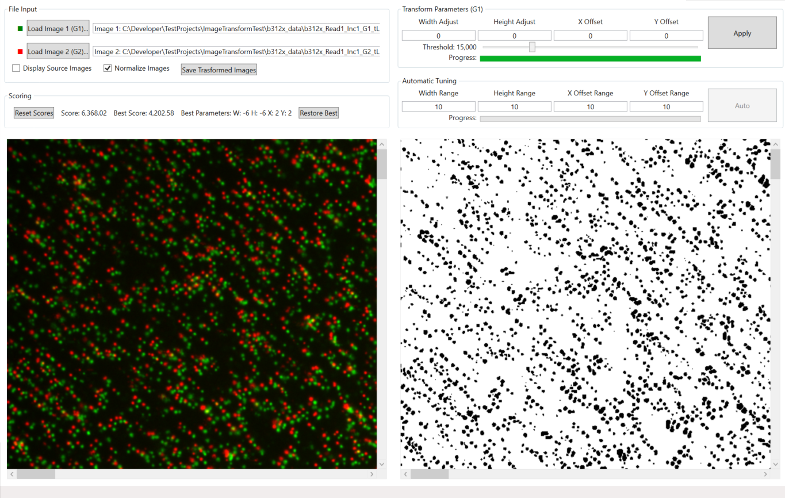

<!-- PAGE TITLE -->
## Sequlite Image Transformer
Image Transformer is a libary used to apply affine transformations to images to compensate for shifts between cameras.
The Image Correction Tool is an engineering tool used to test and optimize transformation parameters.
Image transfomation parameters are stored in Calib.json

<!-- LICENSE -->
## License
Copyright (c) 2022 Sequlite. All rights reserved.